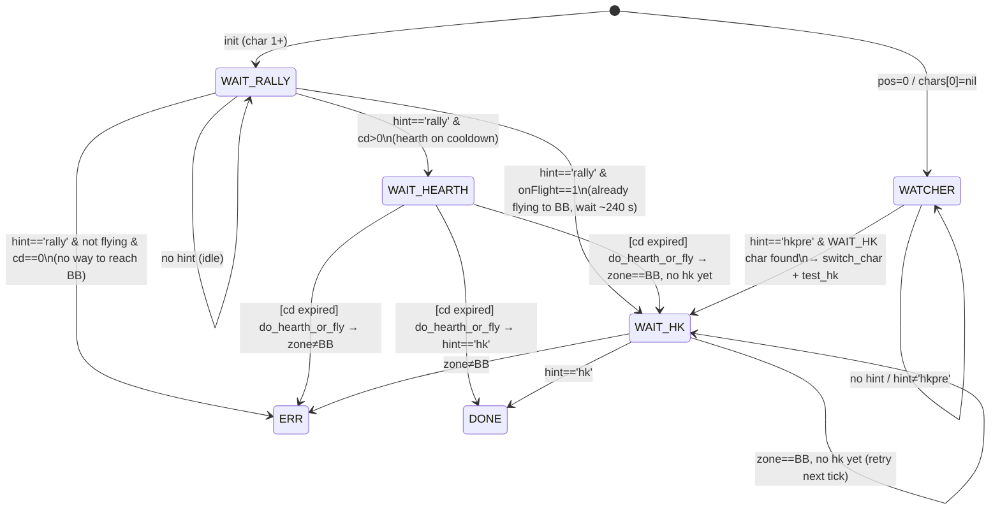

# wow-rally-hk

Rally + HK buff coordination bot for WoW Classic Era.

## Overview

Coordinates multiple city characters to receive the **Rally** and **HK** (Honorable Kill)
buffs in Booty Bay, plus a dedicated **Watcher** character that monitors the yell channel
for incoming HK pre-announcements.

| Constant      | Value | Meaning                                      |
|---------------|-------|----------------------------------------------|
| `WAIT_RALLY`  | 1     | Idle in city, waiting for a `rally` hint     |
| `WAIT_HEARTH` | 2     | Rally seen but hearth on cooldown             |
| `WAIT_HK`     | 3     | In Booty Bay, waiting for the HK buff        |
| `DONE`        | 0     | HK buff received – finished                  |
| `ERR`         | -1    | Unexpected state, logged and stalled         |
| `WATCHER`     | 4     | pos=0 / chars[0] nil – listens for `hkpre`  |

## Game Setup

### 1. Character Order

Log in characters **from bottom to top** in the character selection screen:

| Slot | Role | Location |
|------|------|----------|
| 0 (top) | **Watcher** | Booty Bay inn |
| 1–N | **Buff chars** | Stormwind or Orgrimmar |
| last | **Stop char** | Any inn/city that cannot receive Rally (e.g. Ironforge / Thunder Bluff) |

> The stop char acts as a sentinel so the bot knows when to wrap around.

### 2. WeakAura

Install the **hintlib** WeakAura — it encodes in-game state (zone, hint type, hearth CD,
flight status) into the pixel hint read by the bot.

*Wago import string: TBD*

### 3. Key Bindings

The bot uses two keys per buff char to travel to Booty Bay:

| Key | Action |
|-----|--------|
| `=` | Trigger travel (fly or hearth) |
| `-` | Interact with NPC / taxi confirm (fly option only) |

Choose one travel method per character:

**Option A — Fly (Alliance only)**

> Horde flight to BB requires multiple manual stops and cannot be automated with a macro.
> Horde players must use Option B.

1. Park the char in front of the **Stormwind flight master**.
2. Bind the **Interact with Target** key to `-`.
3. Bind the fly-to-BB macro to `=`.
```
/tar dungar long
/click GossipPopup1Button1
/click StaticPopup1Button1
/run SelectGossipOption(1)
/run for i=1,NumTaxiNodes() do print(i, TaxiNodeName(i)) end
/run TakeTaxiNode(10)
```

**Option B — Hearth**
1. Set the char's hearth to **Booty Bay inn**.
2. Bind the **Hearthstone** (item 6948) to `=`.

---

## State Machine



### Character scheduling (`pick_next`)

Priority order when deciding which character to play next:

1. **WAIT_HEARTH** with expired CD → hearth that char to BB.
2. **WAIT_HK** exists → switch to Watcher (pos 0) to monitor `hkpre`.
3. **WAIT_RALLY** exists, or create a new slot → play/add that char.

---

## WATCHER flow detail

The WATCHER does **one trip per `hkpre` event**, not a persistent loop on the HK char:

1. `hkpre` seen → `switch_char(c.id)` → `test_hk()` (45 s wait)
2. `WATCHER` FSM returns `nil` → `tick()` calls `switch_char(pick_next())`
3. Since the char is still `WAIT_HK` (or just became `DONE`/`ERR`), `pick_next` returns
   `0` → back to watcher immediately
4. Watcher waits for the **next** `hkpre`

This is intentional: the Rally buff has a limited duration but the next HK event could be
hours away. Camping the HK char would cause the Rally buff to expire with no benefit.
Each `hkpre` is one attempt; if the char misses the buff (wrong layer, late, etc.) the
watcher simply waits for the next announcement.
