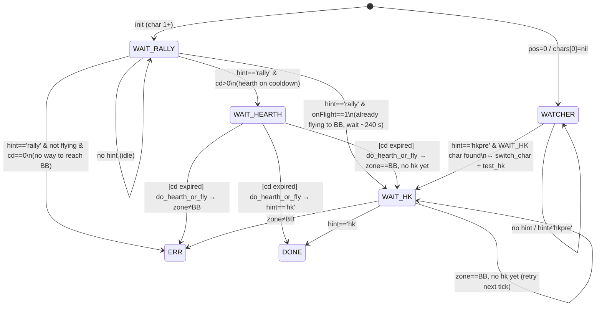

# wow-rally-hk

Rally + HK buff coordination bot for WoW Classic Era.

## Overview

Coordinates multiple city characters to receive the **Rally** and **HK** (Honorable Kill)
buffs in Booty Bay, plus a dedicated **Watcher** character that monitors the yell channel
for incoming HK pre-announcements.

| Constant      | Value | Meaning                                      |
|---------------|-------|----------------------------------------------|
| `WAIT_RALLY`  | 1     | Idle in city, waiting for a `rally` hint     |
| `WAIT_HEARTH` | 2     | Rally seen but hearth on cooldown             |
| `WAIT_HK`     | 3     | In Booty Bay, waiting for the HK buff        |
| `DONE`        | 0     | HK buff received – finished                  |
| `ERR`         | -1    | Unexpected state, logged and stalled         |
| `WATCHER`     | 4     | pos=0 / chars[0] nil – listens for `hkpre`  |

## State Machine

### Character scheduling (`pick_next`)

Priority order when deciding which character to play next:

1. **WAIT_HEARTH** with expired CD → hearth that char to BB.
2. **WAIT_HK** exists → switch to Watcher (pos 0) to monitor `hkpre`.
3. **WAIT_RALLY** exists, or create a new slot → play/add that char.

---

## WATCHER flow detail

The WATCHER does **one trip per `hkpre` event**, not a persistent loop on the HK char:

1. `hkpre` seen → `switch_char(c.id)` → `test_hk()` (45 s wait)
2. `WATCHER` FSM returns `nil` → `tick()` calls `switch_char(pick_next())`
3. Since the char is still `WAIT_HK` (or just became `DONE`/`ERR`), `pick_next` returns
   `0` → back to watcher immediately
4. Watcher waits for the **next** `hkpre`

This is intentional: the Rally buff has a limited duration but the next HK event could be
hours away. Camping the HK char would cause the Rally buff to expire with no benefit.
Each `hkpre` is one attempt; if the char misses the buff (wrong layer, late, etc.) the
watcher simply waits for the next announcement.
